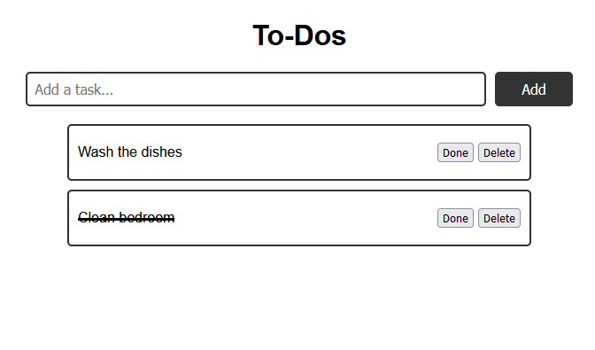
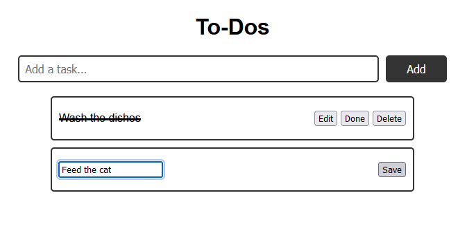

# To-Do-Task-Manager

Your task is to create a To-Do list manager that allows users to add, remove, and update tasks on a webpage.  
The webpage should display a list of tasks that users can add to, delete, or edit as needed.

## Instructions

**Step 1**: Create a basic HTML structure for the To-Do list manager.   
The page should have an input field to add tasks, a button to submit tasks, and a list to display tasks.

**Step 2**: Add functionality to add new tasks.   
When a user enters a new task into the input field and clicks the "Add" button, the new task should be added to the list.

**Step 3** : Add functionality to delete tasks.   
When a user clicks on a task's delete button, it should be removed from the list.

**Step 4**:  Add functionality to toggle tasks as "done" when the user clicks on the done button related to that task.    
When the task is marked as done, the text of the task should be changed to a strike-through text. 

**Step 5**: Add styling to make the To-Do Task manager look nice and visually appealing.  
Consider using CSS to add colors, fonts, and spacing to the page.

**Extra Feature**: Add functionality to edit existing tasks.
- When a user clicks on the "Edit" button of a todo task, it should become editable.   
- The task `p` tag should be changed into an `input` element, and a "Save" button should be available.  
- It's a good idea to make the "Edit" button disabled when the user is editing the current task.  
- The user should be able to change the task text and click a "Save" button to update the task.

## Example

## Example with Edit Feature

