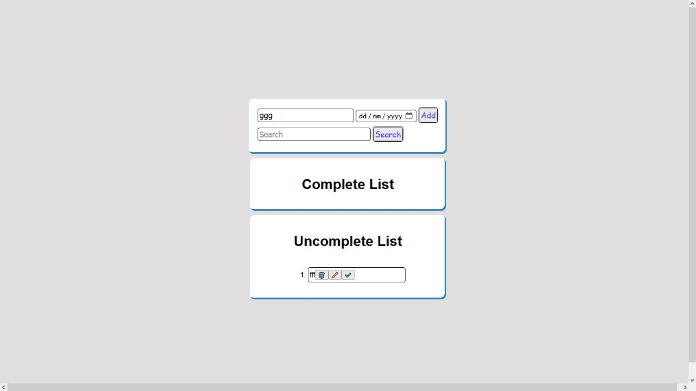

# To-Do-Task-Manager

## when you use To-Do-Task-Manager you can save , remove and edit your tasks and you can put your task in complete or uncomplete list from done button

## Example

## Example with Edit Feature

## Example with Done Feature

